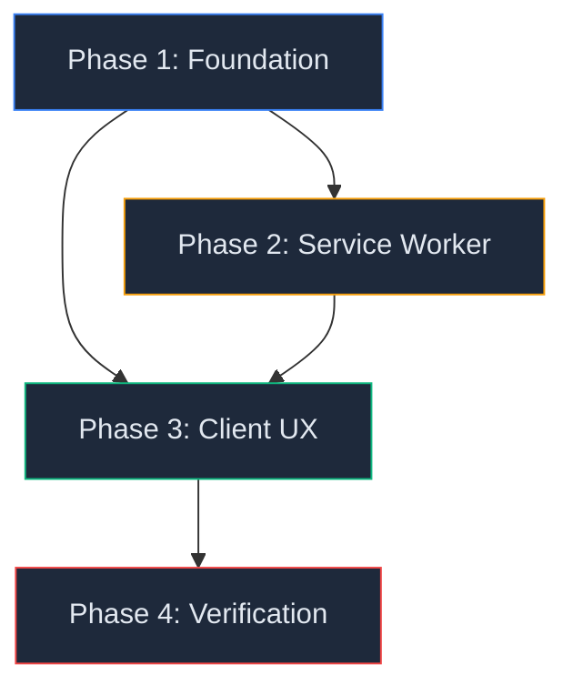

# Master Phased Implementation Plan — SpellcastersDB PWA

> **Tooling:** `@serwist/next` + `serwist` (the Workbox successor, Turbopack-native)
>
> **Framework:** Next.js 16 (App Router, React Server Components)

---

## Strategic Decision: Why Serwist?

| Option              | Verdict                                                                                              |
| ------------------- | ---------------------------------------------------------------------------------------------------- |
| Hand-written SW     | Error-prone with Next.js App Router. Must manually track build hashes, fight Vercel CDN caching.     |
| `next-pwa`          | Requires Webpack override on Next.js 16 (Turbopack default). Maintenance uncertain.                  |
| **`@serwist/next`** | **Turbopack-native. Auto-precaches build chunks. Typed `sw.ts`. Active maintenance. Official docs.** |

---

## Technical Constraints

| #   | Constraint                                                                                  | Mitigation                                                                                                    |
| --- | ------------------------------------------------------------------------------------------- | ------------------------------------------------------------------------------------------------------------- |
| C1  | **Next.js 16 on Vercel** — Edge CDN serves ISR HTML. SW must not fight cache headers.       | Serwist's `defaultCache` uses Network-first for navigations; SW only caches the response as offline fallback. |
| C2  | **20+ routes (7 dynamic)** — `/incantations/units/[id]` generates thousands of unique URLs. | Cannot precache all pages. Serwist runtime-caches pages on visit (LRU 50).                                    |
| C3  | **`searchParams` for deck/team hashes** — `/?deck=HASH` are unique per share.               | `defaultCache` strips query params for navigation cache keys. `useUrlSync` re-parses client-side.             |
| C4  | **GitHub Pages API is static JSON** — No auth, no cookies, files change on repo push only.  | Perfect for `StaleWhileRevalidate`. Custom runtime cache entry targeting `terribleturtle.github.io`.          |
| C5  | **`server-only` in `api.ts`** — Client never calls GitHub API directly.                     | SW caches the SSR HTML response. For offline reloads we also cache the JSON endpoints for client hydration.   |
| C6  | **Zustand localStorage** — Decks/teams persist in `spellcasters-store-v2`.                  | No migration needed. Deck ops are purely client-side. SW does not touch localStorage.                         |
| C7  | **Existing strict CSP** — `default-src 'none'`, explicit directives.                        | Must add `worker-src 'self'` to CSP before deploying SW.                                                      |
| C8  | **API routes must be excluded** — `/api/og`, `/api/revalidate`, `/api/local-assets`.        | `defaultCache` already excludes `/api/*`. SW never intercepts server-only routes.                             |

---

## Edge Cases

| #   | Edge Case                                            | Mitigation                                                                                                                         |
| --- | ---------------------------------------------------- | ---------------------------------------------------------------------------------------------------------------------------------- |
| E1  | User visits `/?deck=HASH` offline for the first time | `/~offline` fallback renders. Root page is precached on install; `useUrlSync` parses `searchParams` client-side from localStorage. |
| E2  | SW update mid-session                                | `skipWaiting: true` + `clientsClaim: true` ensures immediate activation. Serwist handles gracefully.                               |
| E3  | Card images exceed LRU cap                           | Oldest entries evicted. Frequently browsed cards stay in cache naturally.                                                          |
| E4  | Vercel deploys new build, old SW still active        | Serwist auto-versions precache entries via build hash injection. Old caches are pruned on activate.                                |
| E5  | `/_next/static/` hash changes on deploy              | Hash-based URLs = new cache entries. Old entries cleaned automatically by Serwist precache lifecycle.                              |
| E6  | `navigator.onLine` is unreliable                     | Offline indicator is additive UX only. Core functionality doesn't depend on it.                                                    |

---

## Risk Register

| #   | Risk                              | Likelihood | Impact   | Mitigation                                                               |
| --- | --------------------------------- | ---------- | -------- | ------------------------------------------------------------------------ |
| R1  | SW caches stale HTML after deploy | Low        | High     | Serwist auto-versions via `__SW_MANIFEST`. Git revision on `/~offline`.  |
| R2  | CSP blocks SW registration        | Low        | Critical | Add `worker-src 'self'` in Phase 1 before any SW code.                   |
| R3  | Unbounded cache storage on mobile | Medium     | Medium   | `defaultCache` uses LRU caps. Images capped at 100.                      |
| R4  | SW intercepts API routes          | Low        | Critical | `defaultCache` excludes `/api/*` by default.                             |
| R5  | Offline fallback page unstyled    | Low        | Low      | Use a Next.js route (`/~offline`) so it inherits the app's theme/layout. |

---

## Dependency Map



---

## Phase 1: Foundation

**Goal:** Install tooling, create manifest, generate icons, update CSP + tsconfig. Zero runtime behavior changes.

### Deliverables

| #   | File                        | Action | Description                                                                             |
| --- | --------------------------- | ------ | --------------------------------------------------------------------------------------- |
| 1.1 | `package.json`              | MODIFY | `npm install @serwist/next serwist`                                                     |
| 1.2 | `src/app/manifest.ts`       | NEW    | Type-safe `MetadataRoute.Manifest` — name, short_name, icons, display, theme, start_url |
| 1.3 | `public/icons/icon-192.png` | NEW    | Generated from `public/logo.svg` via `sharp`                                            |
| 1.4 | `public/icons/icon-512.png` | NEW    | Generated from `public/logo.svg` via `sharp` (also maskable)                            |
| 1.5 | `next.config.ts`            | MODIFY | Wrap with `withSerwist({ swSrc: "app/sw.ts", swDest: "public/sw.js" })`                 |
| 1.6 | `next.config.ts`            | MODIFY | Add `worker-src 'self'` to CSP directive                                                |
| 1.7 | `tsconfig.json`             | MODIFY | Add `"@serwist/next/typings"` to `types`, `"webworker"` to `lib`                        |
| 1.8 | `.gitignore`                | MODIFY | Add `public/sw*` and `public/swe-worker*`                                               |
| 1.9 | `src/app/layout.tsx`        | MODIFY | Add `applicationName`, `appleWebApp` to metadata; update `icons` to reference PNGs      |

### Definition of Done

- [x] `npm run build` succeeds
- [x] `npm test` passes (no regressions)
- [x] Chrome DevTools → Application → Manifest shows valid manifest with icons
- [x] CSP header includes `worker-src 'self'` (verify in response headers)
- [x] `tsconfig.json` includes `webworker` lib (no type errors in `sw.ts`)
- [x] No functional changes to the application

---

## Phase 2: Service Worker & Caching

**Goal:** Create the typed service worker and offline fallback route. Serwist auto-registers; no manual `navigator.serviceWorker.register()` needed.

### Deliverables

| #   | File                        | Action | Description                                                                                 |
| --- | --------------------------- | ------ | ------------------------------------------------------------------------------------------- |
| 2.1 | `src/app/sw.ts`             | NEW    | Serwist SW config: `defaultCache` + custom GitHub API + image runtime caching rules         |
| 2.2 | `src/app/~offline/page.tsx` | NEW    | Next.js route serving the offline fallback page (inherits app theme/layout via `PageShell`) |

### `sw.ts` Architecture

```typescript
import { defaultCache } from "@serwist/next/worker";
import type { PrecacheEntry, SerwistGlobalConfig } from "serwist";
import { Serwist } from "serwist";

declare global {
  interface WorkerGlobalScope extends SerwistGlobalConfig {
    __SW_MANIFEST: (PrecacheEntry | string)[] | undefined;
  }
}
declare const self: ServiceWorkerGlobalScope;

const serwist = new Serwist({
  precacheEntries: self.__SW_MANIFEST,
  skipWaiting: true,
  clientsClaim: true,
  navigationPreload: true,
  runtimeCaching: [
    ...defaultCache,
    // GitHub Pages JSON API — StaleWhileRevalidate
    {
      urlPattern: /^https:\/\/terribleturtle\.github\.io\/.*\.json$/,
      handler: "StaleWhileRevalidate",
      options: { cacheName: "sc-api-data" },
    },
    // Card images from GitHub Pages — CacheFirst w/ LRU
    {
      urlPattern:
        /^https:\/\/terribleturtle\.github\.io\/.*\.(png|jpg|webp|avif)$/,
      handler: "CacheFirst",
      options: {
        cacheName: "sc-card-images",
        expiration: { maxEntries: 200, maxAgeSeconds: 30 * 24 * 60 * 60 },
      },
    },
  ],
  fallbacks: {
    entries: [
      {
        url: "/~offline",
        matcher({ request }) {
          return request.destination === "document";
        },
      },
    ],
  },
});

serwist.addEventListeners();
```

### Definition of Done

- [x] `npm run build` succeeds (SW compiled to `public/sw.js`)
- [x] Production build (`npm start`): DevTools → Application → Service Workers shows active SW
- [x] Caches populate correctly (static assets, API data on visit)
- [x] Toggling network off → navigating to uncached page → `/~offline` renders
- [x] `/api/*` requests bypass SW completely

---

## Phase 3: Client UX

**Goal:** Add offline status indicator and SW update awareness.

### Deliverables

| #   | File                                      | Action | Description                                                               |
| --- | ----------------------------------------- | ------ | ------------------------------------------------------------------------- |
| 3.1 | `src/components/pwa/OfflineIndicator.tsx` | NEW    | Client component: `online`/`offline` event listeners → subtle toast/badge |
| 3.2 | `src/app/layout.tsx`                      | MODIFY | Mount `<OfflineIndicator />` in root layout                               |

### Definition of Done

- [x] Offline indicator appears when network toggled off in DevTools
- [x] Indicator auto-dismisses with "Back online" when network returns
- [x] `npm test` passes (no regressions)
- [x] No console errors related to SW on any page

---

## Phase 4: Verification & Hardening

**Goal:** Full validation and documentation updates.

### Checklist

- [x] `npm run type-check && npm run lint && npm test && npm run build` — all pass
- [ ] Lighthouse PWA audit — all checks green (installable, SW, manifest, HTTPS) (POST-DEPLOY)
- [ ] Manual offline matrix (see below) (POST-DEPLOY)
- [x] `active_state.md` updated
- [x] `CHANGELOG.md` updated

### Manual Test Matrix

| #   | Scenario                                       | Offline? | Expected Result                                            |
| --- | ---------------------------------------------- | -------- | ---------------------------------------------------------- |
| T1  | Fresh visit, reload cached root                | ✅       | Deck builder loads from cache                              |
| T2  | `/?deck=HASH` offline                          | ✅       | Root page loads, `useUrlSync` hydrates deck from hash      |
| T3  | Navigate to `/spellcasters/firebrand` (cached) | ✅       | Page loads from runtime cache                              |
| T4  | Navigate to uncached page                      | ✅       | `/~offline` fallback renders with app theme                |
| T5  | Save deck offline                              | ✅       | Persists to localStorage                                   |
| T6  | Share deck offline                             | ✅       | URL generated client-side (lz-string)                      |
| T7  | Return online after offline session            | ✅       | Background revalidation fires silently                     |
| T8  | New SW deployed (version change)               | ❌       | Old SW replaced, new precache entries activate immediately |
| T9  | Install as PWA (Add to Home Screen)            | ❌       | Standalone window opens, no browser chrome                 |
