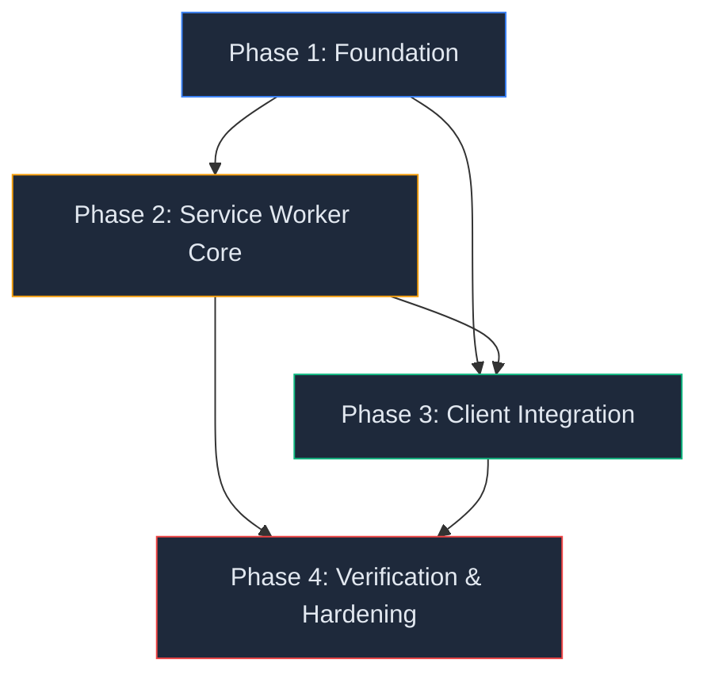

# Master Phased Implementation Plan — SpellcastersDB PWA

## Deep-Dive Findings

### Technical Constraints

| #   | Constraint                                                                                                                                                               | Impact                                                                                                                                                                                                                                                                                            |
| --- | ------------------------------------------------------------------------------------------------------------------------------------------------------------------------ | ------------------------------------------------------------------------------------------------------------------------------------------------------------------------------------------------------------------------------------------------------------------------------------------------- |
| C1  | **Next.js 16 on Vercel** — Vercel's edge network serves pre-rendered HTML. SW must not fight ISR cache headers.                                                          | SW uses Network-first for HTML; lets Vercel's CDN serve, SW only caches the _response_ for offline fallback.                                                                                                                                                                                      |
| C2  | **20 page routes (7 dynamic)** — Routes like `/incantations/units/[id]` and `/spellcasters/[id]` generate thousands of unique URLs.                                      | Cannot precache all pages. SW caches pages _on visit_ into a 50-entry LRU.                                                                                                                                                                                                                        |
| C3  | **API routes must be excluded** — `/api/og`, `/api/revalidate`, `/api/local-assets` are server-only and must never be intercepted by SW.                                 | SW explicitly skips all requests matching `/_next/` (except `/_next/static/`) and `/api/`.                                                                                                                                                                                                        |
| C4  | **`searchParams` for deck/team hashes** — `/?deck=HASH` and `/?team=HASH` are unique per share. Caching the root page with `?deck=` params would serve stale deck views. | SW strips `searchParams` for cache-key matching on navigation. URL hash is client-parsed by `useUrlSync` — no server dependency.                                                                                                                                                                  |
| C5  | **`server-only` module in `api.ts`** — All data fetching is server-side. Client never calls the GitHub API directly.                                                     | SW intercepts the _server's_ fetch to GitHub Pages (on Vercel edge), BUT the client receives the SSR HTML with data embedded. SW caches the _HTML response_ for offline. For client-side freshness, we also cache the static JSON endpoints so the SW can serve them if the user reloads offline. |
| C6  | **Zustand localStorage (`spellcasters-store-v2`)** — Decks/teams persist in localStorage (sync, ~5MB limit).                                                             | No migration needed. Deck ops are purely client-side. SW does not touch localStorage.                                                                                                                                                                                                             |
| C7  | **GitHub Pages API is static JSON** — No auth, no cookies, no query params. Files change on repo push only.                                                              | Perfect for aggressive caching. Stale-while-revalidate with no expiry concern.                                                                                                                                                                                                                    |
| C8  | **Existing CSP is strict** — `default-src 'none'`, explicit `connect-src`, `script-src`.                                                                                 | Must add `worker-src 'self'` — any other value would be a security regression.                                                                                                                                                                                                                    |

### Edge Cases Identified

| #   | Edge Case                                            | Mitigation                                                                                                                                                                                                                  |
| --- | ---------------------------------------------------- | --------------------------------------------------------------------------------------------------------------------------------------------------------------------------------------------------------------------------- |
| E1  | User visits `/?deck=HASH` offline for the first time | Without a cached `/` page, offline fallback shows. But `/` is precached on SW install, so root page always available. `useUrlSync` parses `searchParams` client-side and hydrates from localStorage — works in cached mode. |
| E2  | SW update mid-session                                | `skipWaiting()` is NOT called automatically. New SW waits until all tabs close. Update toast gives user control.                                                                                                            |
| E3  | Card images exceed 300-entry LRU cap                 | Oldest entries evicted. Common cards (browsed frequently) naturally stay in cache.                                                                                                                                          |
| E4  | Vercel deploys new build, old SW still active        | Version-gated cache purge. On `activate`, old caches with mismatched version prefix are deleted. User sees update toast.                                                                                                    |
| E5  | `/_next/static/` hash changes on deploy              | Cache-first is safe — new hashes = new URLs = new cache entries. Old entries cleaned on version bump.                                                                                                                       |
| E6  | OG image API routes (`/api/og?...`)                  | SW explicitly excludes `/api/*`. These are server-rendered and never cached.                                                                                                                                                |
| E7  | `navigator.onLine` is unreliable on some networks    | Offline indicator is additive UX only. Core functionality doesn't depend on it. SW fetch failures are the true offline signal.                                                                                              |
| E8  | Safari/iOS lacks Navigation Preload                  | Feature-detected. Falls back to standard Network-first without preload — no breakage.                                                                                                                                       |

---

## Risk Register

| #   | Risk                                                 | Likelihood | Impact   | Mitigation                                                                 |
| --- | ---------------------------------------------------- | ---------- | -------- | -------------------------------------------------------------------------- |
| R1  | SW caches stale HTML after deploy                    | Medium     | High     | Version-gated activate purge + `Cache-Control: no-cache` on `sw.js`        |
| R2  | CSP blocks SW registration                           | Low        | Critical | Add `worker-src 'self'` before deploying SW                                |
| R3  | Unbounded cache storage on mobile                    | Medium     | Medium   | LRU caps: 300 images, 50 pages. Static cleaned on version bump.            |
| R4  | `manifest.ts` type mismatch with Next.js 16          | Low        | Low      | Validate with `npm run build` — Next.js type-checks manifest at build time |
| R5  | SW intercepts API routes, breaks revalidation        | Low        | Critical | Explicit exclusion: `url.pathname.startsWith('/api/')` → bypass SW         |
| R6  | Offline fallback page unstyled/broken                | Low        | Low      | Self-contained HTML, zero external deps, inline CSS                        |
| R7  | Update toast fires too aggressively                  | Medium     | Low      | Only fires on `statechange` to `installed` on a _new_ SW, debounced        |
| R8  | `searchParams` cached in page URL, serves wrong deck | Medium     | High     | Strip search/hash from cache key. `useUrlSync` re-parses on client.        |

---

## Dependency Map



---

## Phase 1: Foundation

**Goal:** Establish installability and security headers. Zero runtime behavior changes.

### Deliverables

| #   | File                      | Type   | Description                                                                            |
| --- | ------------------------- | ------ | -------------------------------------------------------------------------------------- |
| 1.1 | `src/app/manifest.ts`     | NEW    | Type-safe PWA manifest (name, icons, display, theme)                                   |
| 1.2 | `public/icon-192x192.png` | NEW    | App icon (192×192)                                                                     |
| 1.3 | `public/icon-512x512.png` | NEW    | App icon (512×512, also maskable)                                                      |
| 1.4 | `public/offline.html`     | NEW    | Self-contained offline fallback page                                                   |
| 1.5 | `next.config.ts`          | MODIFY | Add `worker-src 'self'` to CSP, add `Cache-Control: no-cache` header rule for `/sw.js` |
| 1.6 | `src/app/layout.tsx`      | MODIFY | Add apple-touch-icon + PNG icons to `metadata.icons`                                   |

### Definition of Done

- [ ] `npm run build` succeeds
- [ ] `npm test` passes (no regressions)
- [ ] Chrome DevTools → Application → Manifest shows valid manifest with icons
- [ ] `offline.html` renders correctly when opened directly
- [ ] CSP header includes `worker-src 'self'` (verify in response headers)
- [ ] No functional changes to the application

### Blockers for Next Phase

- Icons must exist before manifest references them
- CSP must allow workers before SW registration

---

## Phase 2: Service Worker Core

**Goal:** Implement the full service worker with all 5 cache tiers. No client-side registration yet (can be tested manually in DevTools).

### Deliverables

| #   | File           | Type | Description                              |
| --- | -------------- | ---- | ---------------------------------------- |
| 2.1 | `public/sw.js` | NEW  | Hand-written service worker (~250 lines) |

### SW Internal Architecture

```
sw.js
├── Constants (VERSION, CACHE_NAMES, API_ORIGIN, PRECACHE_URLS)
├── install → precache offline.html + root page
├── activate → delete old caches, enable Navigation Preload
└── fetch
    ├── Skip: non-GET, /api/*, chrome-extension://*
    ├── Navigation → networkFirst(sc-pages-v1, 50) → offline.html fallback
    ├── /_next/static/* → cacheFirst(sc-static-v1)
    ├── API JSON (*.json from API_ORIGIN) → staleWhileRevalidate(sc-data-v1) + postMessage
    ├── Images (API_ORIGIN + /_next/image) → cacheFirst(sc-images-v1, 300 LRU)
    └── Default → network passthrough (no caching)
```

### Definition of Done

- [ ] SW file is syntactically valid JS (no TS — runs in worker context)
- [ ] `npm run build` succeeds
- [ ] Manual test: register SW in DevTools console (`navigator.serviceWorker.register('/sw.js')`)
- [ ] Caches populate correctly for each tier
- [ ] Navigation Preload is feature-detected and enabled only when supported
- [ ] `/api/*` requests bypass SW completely
- [ ] `searchParams` stripped from navigation cache keys
- [ ] LRU eviction works (verifiable by checking cache entry count in DevTools)

### Blockers for Next Phase

- SW must be functional before client-side registration component can use it

---

## Phase 3: Client Integration

**Goal:** Wire the SW into the React app with registration, update UX, and offline awareness.

### Deliverables

| #   | File                                               | Type   | Description                                                            |
| --- | -------------------------------------------------- | ------ | ---------------------------------------------------------------------- |
| 3.1 | `src/components/pwa/ServiceWorkerRegistration.tsx` | NEW    | Client component: registers SW, listens for updates + data messages    |
| 3.2 | `src/hooks/useOnlineStatus.ts`                     | NEW    | Hook: `navigator.onLine` + event listeners → `isOnline`                |
| 3.3 | `src/components/pwa/OfflineIndicator.tsx`          | NEW    | Subtle bottom banner when offline, auto-dismiss on reconnect           |
| 3.4 | `src/app/layout.tsx`                               | MODIFY | Add `<ServiceWorkerRegistration />` and `<OfflineIndicator />` to body |

### Key Integration Decisions

| Decision                                        | Rationale                                                          |
| ----------------------------------------------- | ------------------------------------------------------------------ |
| SW registration in `useEffect`, production only | `next dev` uses HMR which conflicts with SW caching                |
| Update toast uses existing `Toaster` component  | No new UI library needed, consistent with app design               |
| No forced `skipWaiting()`                       | Avoids mid-session cache invalidation; user controls update timing |
| `postMessage("DATA_UPDATED")` from SW           | Enables optional "New data available" toast without polling        |
| `OfflineIndicator` is purely additive           | No core logic depends on `navigator.onLine` — it's just UX sugar   |

### Definition of Done

- [ ] SW auto-registers on production build (`npm run build && npm start`)
- [ ] DevTools → Application → Service Workers shows active SW with scope `/`
- [ ] Update toast appears when a new SW version is deployed (simulate by editing `sw.js` version)
- [ ] Offline indicator appears when network is toggled off in DevTools
- [ ] Indicator auto-dismisses with "Back online" when network returns
- [ ] `npm test` passes (no regressions)
- [ ] No console errors related to SW on any page

### Blockers for Next Phase

- None — Phase 4 is verification-only

---

## Phase 4: Verification & Hardening

**Goal:** Full validation, documentation update, and production readiness.

### Deliverables

| #   | Activity              | Description                                            |
| --- | --------------------- | ------------------------------------------------------ |
| 4.1 | Automated suite       | `type-check` + `lint` + `test` + `build`               |
| 4.2 | Lighthouse PWA audit  | All PWA checks pass (installable, SW, manifest, HTTPS) |
| 4.3 | Manual offline matrix | Test all 11 scenarios from verification table          |
| 4.4 | `active_state.md`     | Update with PWA status                                 |
| 4.5 | `CHANGELOG.md`        | Add PWA entry                                          |

### Manual Test Matrix

| #   | Scenario                                       | Offline? | Expected Result                                          |
| --- | ---------------------------------------------- | -------- | -------------------------------------------------------- |
| T1  | Fresh visit, cached root                       | ✅       | Deck builder loads from cache                            |
| T2  | `/?deck=HASH` offline                          | ✅       | Root page loads, `useUrlSync` parses hash, hydrates deck |
| T3  | `/?team=HASH` offline                          | ✅       | Root page loads, team decoded from hash                  |
| T4  | Navigate to `/spellcasters/firebrand` (cached) | ✅       | Page loads from `sc-pages-v1`                            |
| T5  | Navigate to uncached page                      | ✅       | `offline.html` fallback                                  |
| T6  | Save deck offline                              | ✅       | Persists to localStorage                                 |
| T7  | Share deck offline                             | ✅       | URL generated client-side (lz-string)                    |
| T8  | Reload with data in `sc-data-v1`               | ✅       | SSR HTML loads, card images from image cache             |
| T9  | Return online after offline session            | ✅       | Background revalidation fires, data refreshes silently   |
| T10 | New SW deployed                                | ❌       | Update toast: "Update available — Tap to refresh"        |
| T11 | Install as PWA                                 | ❌       | Standalone window opens, no browser chrome               |

### Definition of Done

- [ ] All automated checks pass
- [ ] Lighthouse PWA score: all checks green
- [ ] All 11 manual test scenarios verified
- [ ] `active_state.md` updated
- [ ] `CHANGELOG.md` updated
- [ ] No console errors on any page (production build)
