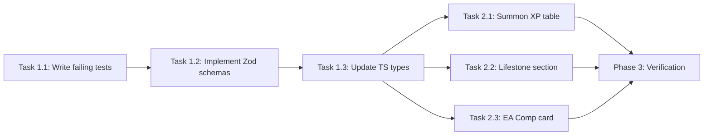

# v0.2.0 Consumer Schema Changes — Implementation Plan

> **For Claude:** REQUIRED SUB-SKILL: Use superpowers:executing-plans to implement this plan task-by-task.

**Goal:** Integrate three v0.2.0 API additions into the SpellcastersDB consumer app: `match_xp.summon_xp`, `game_systems.map_objects`, and `starting_knowledge.early_access_compensation` — with types, validation, UI, and tests.

**Architecture:** Static JSON API consumer. Zod validates inbound API JSON, transforms wire keys to internal names, and TypeScript interfaces define the app-side shape. The Mechanics guide page (`/guide/mechanics`) renders game system data via `getGameSystems()`. No database, no backend state.

**Tech Stack:** Next.js 16, TypeScript, Zod, Vitest, Tailwind CSS v4

---

> [!NOTE]
> **Key casing context (no action needed):** The new `summon_xp` field uses **lowercase** keys (`rank_i`, `rank_ii`). The existing `kills`/`summoning` uses **uppercase** (`rank_I`, `rank_II`). Both are correct — they match their respective API wire formats. The Zod schemas mirror whatever the API sends.

---

## Phase 1: Zod Schemas + TypeScript Types (Tests First)

**Definition of Done:** `SummonXPSchema`, `MapObjectsSchema` parse correctly. `MatchXPSchema` transform passes `summon_xp` through. `GameSystemsSchema` accepts optional `map_objects`. `ProgressionConfigSchema` accepts `early_access_compensation`. All existing + new tests pass.

---

### Task 1.1: Write Failing Tests

**Files:**
- Modify: `src/services/validation/__tests__/data-schemas.test.ts`

**Step 1: Add `summon_xp` tests to `MatchXPSchema` block (after line 312)**

```typescript
    it("should pass summon_xp through the transform when present", () => {
      const data = {
        kills: {
          spellcaster_death: 250,
          rank_I: 50,
          rank_II: 100,
          rank_III: 300,
          rank_IV: 500,
        },
        summon_xp: {
          rank_i: 50,
          rank_ii: 150,
          rank_iii: 300,
          rank_iv: 500,
        },
      };

      const parsed = MatchXPSchema.parse(data);
      expect(parsed.summon_xp).toBeDefined();
      expect(parsed.summon_xp?.rank_i).toBe(50);
      expect(parsed.summon_xp?.rank_ii).toBe(150);
      expect(parsed.summon_xp?.rank_iii).toBe(300);
      expect(parsed.summon_xp?.rank_iv).toBe(500);
    });

    it("should leave summon_xp undefined when absent", () => {
      const data = {
        kills: {
          spellcaster_death: 250,
          rank_I: 50,
          rank_II: 100,
          rank_III: 300,
          rank_IV: 500,
        },
      };

      const parsed = MatchXPSchema.parse(data);
      expect(parsed.summon_xp).toBeUndefined();
    });
```

**Step 2: Add `GameSystemsSchema` tests (new describe block after MatchXPSchema)**

Import `GameSystemsSchema` from `../data-schemas`.

```typescript
  describe("GameSystemsSchema", () => {
    const validBase = {
      progression: {
        starting_knowledge: { default: 250, beta: 1000, early_access_compensation: 2000 },
        earn_rates: { first_daily_match: 200, win: 50, loss: 20 },
      },
      ranked: {
        tiers_per_rank: 3,
        rp_gain_per_win: 100,
        ranks: [{ name: "Bronze", rp_threshold_min: 0, rp_loss_per_loss: 50 }],
      },
      match_xp: {},
    };

    it("should parse without map_objects (backward compat)", () => {
      const parsed = GameSystemsSchema.parse(validBase);
      expect(parsed.map_objects).toBeUndefined();
    });

    it("should parse with map_objects.lifestone", () => {
      const data = {
        ...validBase,
        map_objects: {
          lifestone: {
            heal_per_sec: 10,
            heal_target: "Spellcaster",
            heal_range: "territory",
          },
        },
      };

      const parsed = GameSystemsSchema.parse(data);
      expect(parsed.map_objects?.lifestone?.heal_per_sec).toBe(10);
      expect(parsed.map_objects?.lifestone?.heal_target).toBe("Spellcaster");
    });

    it("should parse early_access_compensation in starting_knowledge", () => {
      const parsed = GameSystemsSchema.parse(validBase);
      expect(parsed.progression.starting_knowledge.early_access_compensation).toBe(2000);
    });
  });
```

**Step 3: Run tests to verify they fail**

Run: `npx vitest run src/services/validation/__tests__/data-schemas.test.ts`
Expected: FAIL

---

### Task 1.2: Implement Zod Schema Changes

**Files:**
- Modify: `src/services/validation/data-schemas.ts`

**Step 1: Add `SummonXPSchema` (before `MatchXPSchema`, ~line 491)**

```typescript
const SummonXPSchema = z.object({
  rank_i: z.number().int().min(0),
  rank_ii: z.number().int().min(0),
  rank_iii: z.number().int().min(0),
  rank_iv: z.number().int().min(0),
});
```

**Step 2: Update `MatchXPSchema` (line 492–502)**

```diff
 export const MatchXPSchema = z
   .object({
     capture: CaptureXPSchema.optional(),
     kills: SummoningXPSchema.optional(),
+    summon_xp: SummonXPSchema.optional(),
     scaling: ScalingXPSchema.optional(),
   })
   .transform((data) => ({
     capture: data.capture,
     summoning: data.kills,
+    summon_xp: data.summon_xp,
     scaling: data.scaling,
   }));
```

**Step 3: Add `early_access_compensation` to `ProgressionConfigSchema` (line 504–508)**

```diff
 const ProgressionConfigSchema = z.object({
   starting_knowledge: z.object({
     default: z.number(),
     beta: z.number(),
+    early_access_compensation: z.number().int().min(0),
   }),
   earn_rates: z.object({
```

**Step 4: Add `LifestoneSchema` + `MapObjectsSchema` (before `GameSystemsSchema`)**

```typescript
const LifestoneSchema = z.object({
  heal_per_sec: z.number().min(0),
  heal_target: z.string(),
  heal_range: z.string(),
});

const MapObjectsSchema = z.object({
  lifestone: LifestoneSchema.optional(),
});
```

**Step 5: Update `GameSystemsSchema` (line 528–532)**

```diff
 export const GameSystemsSchema = z.object({
   progression: ProgressionConfigSchema,
   ranked: RankedConfigSchema,
   match_xp: MatchXPSchema,
+  map_objects: MapObjectsSchema.optional(),
 });
```

**Step 6: Run tests**

Run: `npx vitest run src/services/validation/__tests__/data-schemas.test.ts`
Expected: ALL PASS

---

### Task 1.3: Update TypeScript Type Definitions

**Files:**
- Modify: `src/types/api.d.ts`

**Step 1: Add `SummonXP` interface (after `SummoningXP`, ~line 431)**

```typescript
export interface SummonXP {
  rank_i: number;
  rank_ii: number;
  rank_iii: number;
  rank_iv: number;
}
```

**Step 2: Add `Lifestone` and `MapObjects` interfaces (after `ScalingXP`, ~line 436)**

```typescript
export interface Lifestone {
  heal_per_sec: number;
  heal_target: string;
  heal_range: string;
}

export interface MapObjects {
  lifestone?: Lifestone;
}
```

**Step 3: Update `MatchXP`**

```diff
 export interface MatchXP {
   capture?: CaptureXP;
   summoning?: SummoningXP;
+  summon_xp?: SummonXP;
   scaling?: ScalingXP;
 }
```

**Step 4: Update `ProgressionConfig`**

```diff
 export interface ProgressionConfig {
-  starting_knowledge: { default: number; beta: number };
+  starting_knowledge: { default: number; beta: number; early_access_compensation: number };
   earn_rates: { first_daily_match: number; win: number; loss: number };
 }
```

**Step 5: Update `GameSystems`**

```diff
 export interface GameSystems {
   progression: ProgressionConfig;
   ranked: RankedConfig;
   match_xp: MatchXP;
+  map_objects?: MapObjects;
 }
```

**Step 6: Run full test suite + lint**

Run: `npx vitest run && npm run lint`
Expected: ALL PASS

**Step 7: Commit**

```bash
git add src/services/validation/data-schemas.ts src/types/api.d.ts src/services/validation/__tests__/data-schemas.test.ts
git commit -m "feat: add summon_xp, map_objects, and early_access_compensation schemas

Integrates three v0.2.0 API fields:
- match_xp.summon_xp: XP granted on unit placement (rank_i–iv)
- game_systems.map_objects: optional lifestone healing config
- progression.starting_knowledge.early_access_compensation: 2000 Knowledge grant"
```

---

## Phase 2: UI — Mechanics Guide Page

**Definition of Done:** Summon XP table renders when data is present. Lifestone section renders when `map_objects` is available. EA compensation card renders in Knowledge Currency grid. Lint passes.

---

### Task 2.1: Add Summon XP Table

**Files:**
- Modify: `src/app/guide/mechanics/page.tsx`

After the `{/* Summoning XP */}` section (after line 254), add:

```tsx
            {/* Summon XP (Placement Rewards) */}
            {systems.match_xp.summon_xp && (
              <div className="mb-6">
                <h3 className="text-lg font-semibold text-text-primary mb-3 flex items-center gap-2">
                  <Sparkles size={18} className="text-violet-400" />
                  Summon XP (Placement)
                </h3>
                <p className="text-sm text-text-muted mb-3">
                  XP granted when you place a unit on the field, separate from kill XP.
                </p>
                <div className="overflow-x-auto">
                  <table className="w-full text-sm">
                    <thead>
                      <tr className="border-b border-border-default">
                        <th className="text-left py-2 px-3 text-text-muted font-medium">
                          Rank
                        </th>
                        <th className="text-right py-2 px-3 text-text-muted font-medium">
                          XP
                        </th>
                      </tr>
                    </thead>
                    <tbody className="divide-y divide-border-subtle">
                      {(
                        [
                          ["Rank I", systems.match_xp.summon_xp.rank_i],
                          ["Rank II", systems.match_xp.summon_xp.rank_ii],
                          ["Rank III", systems.match_xp.summon_xp.rank_iii],
                          ["Rank IV", systems.match_xp.summon_xp.rank_iv],
                        ] as const
                      ).map(([label, xp]) => (
                        <tr key={label}>
                          <td className="py-2.5 px-3 text-text-secondary">
                            {label}
                          </td>
                          <td className="py-2.5 px-3 text-right font-semibold text-violet-400">
                            {xp}
                          </td>
                        </tr>
                      ))}
                    </tbody>
                  </table>
                </div>
              </div>
            )}
```

---

### Task 2.2: Add Lifestone / Map Objects Section

**Files:**
- Modify: `src/app/guide/mechanics/page.tsx`

Import `Heart` from `lucide-react` (add to line 1 import). After the Match XP card (after line 286), add:

```tsx
        {/* ── Map Objects ─────────────────────────────── */}
        {systems?.map_objects?.lifestone && (
          <section className="bg-surface-card border border-border-default rounded-xl p-5 md:p-8">
            <div className="flex items-center gap-3 mb-6">
              <div className="w-10 h-10 rounded-lg bg-linear-to-br from-emerald-500/20 to-teal-500/20 flex items-center justify-center">
                <Heart size={22} className="text-emerald-400" />
              </div>
              <h2 className="text-2xl font-bold text-brand-accent">
                Map Objects
              </h2>
            </div>
            <div className="bg-surface-dim border border-border-default rounded-lg p-4">
              <h3 className="text-lg font-semibold text-text-primary mb-2">
                Lifestone
              </h3>
              <p className="text-sm text-text-secondary mb-3">
                Permanent map structures that heal your Spellcaster within their
                territory.
              </p>
              <div className="grid grid-cols-3 gap-3">
                <div className="bg-surface-card border border-border-default rounded-lg p-3 text-center">
                  <p className="text-2xl font-bold text-emerald-400 mb-1">
                    {systems.map_objects.lifestone.heal_per_sec}
                  </p>
                  <p className="text-xs text-text-muted">HP / sec</p>
                </div>
                <div className="bg-surface-card border border-border-default rounded-lg p-3 text-center">
                  <p className="text-2xl font-bold text-emerald-400 mb-1">
                    {systems.map_objects.lifestone.heal_target}
                  </p>
                  <p className="text-xs text-text-muted">Target</p>
                </div>
                <div className="bg-surface-card border border-border-default rounded-lg p-3 text-center">
                  <p className="text-2xl font-bold text-emerald-400 mb-1 capitalize">
                    {systems.map_objects.lifestone.heal_range}
                  </p>
                  <p className="text-xs text-text-muted">Range</p>
                </div>
              </div>
            </div>
          </section>
        )}
```

---

### Task 2.3: Add EA Compensation Card to Knowledge Currency Grid

**Files:**
- Modify: `src/app/guide/mechanics/page.tsx`

The current grid (lines 69–94) has 2 cards: "Starting Knowledge" and "Closed Beta Bonus" in a `sm:grid-cols-2` grid. Add a third card and change to `sm:grid-cols-3`:

**Step 1: Update grid to 3 columns**

```diff
-            <div className="grid grid-cols-1 sm:grid-cols-2 gap-4 mb-6">
+            <div className="grid grid-cols-1 sm:grid-cols-3 gap-4 mb-6">
```

**Step 2: Add compensation card after the beta card (after line 93)**

```tsx
              <div className="bg-surface-dim border border-border-default rounded-lg p-4">
                <p className="text-xs font-semibold tracking-wider uppercase text-text-muted mb-1">
                  EA Compensation
                </p>
                <div className="flex items-end gap-3">
                  <span className="text-3xl font-bold text-emerald-400">
                    {systems.progression.starting_knowledge.early_access_compensation.toLocaleString()}
                  </span>
                  <span className="text-sm text-text-muted mb-1">
                    (one-time grant)
                  </span>
                </div>
              </div>
```

**Step 3: Run lint**

Run: `npm run lint`
Expected: 0 errors

**Step 4: Commit**

```bash
git add src/app/guide/mechanics/page.tsx
git commit -m "feat: add summon_xp, lifestone, and EA compensation to Mechanics page

- Summon XP table (placement rewards, Rank I–IV)
- Lifestone healing card under new Map Objects section
- EA compensation card in Knowledge Currency grid (API-driven)"
```

---

## Phase 3: Verification

**Definition of Done:** Full test suite passes, lint passes, dev server renders `/guide/mechanics` correctly.

### Automated

```bash
npx vitest run
npm run lint
```

### Manual

```bash
npm run dev
# Navigate to /guide/mechanics and verify:
# 1. Knowledge Currency grid shows 3 cards (default, beta, EA compensation)
# 2. Summon XP table appears with values (50, 150, 300, 500)
# 3. Lifestone section appears (10 HP/s, Spellcaster, territory)
# 4. No visual regressions on existing sections
```

---

## Dependency Graph


